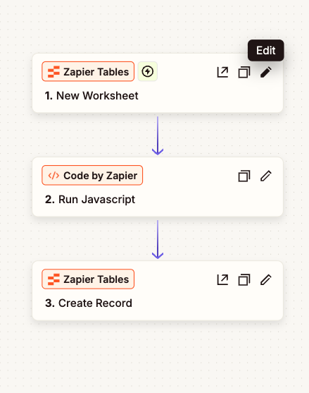
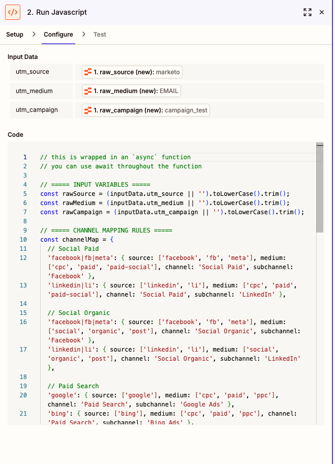
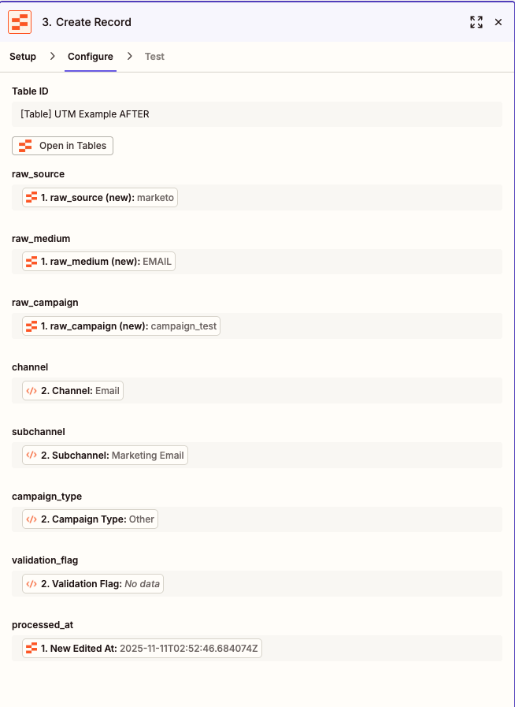

# UTM-Normalization

Reusable automation pattern that standardizes UTM parameters and maps them to clean channel taxonomy—reducing "Unknown" attribution.

---

## The Problem

Marketing teams use inconsistent UTM values:

- **Capitalization issues:** `facebook` vs `Facebook` vs `FB`
- **Medium variants:** `cpc` vs `paid` vs `paid-social` vs `CPC`
- **Source aliases:** `fb` vs `facebook` vs `meta`
- **Missing values:** Empty UTMs default to "Direct" or "Unknown"

**Impact:** Based on the research, a conservative estimate is that 20-40% of web traffic is misattributed to "Direct" due to missing/improper UTM parameters, dark social sharing, and tracking gaps. https://sparktoro.com/blog/new-research-dark-social-falsely-attributes-significant-percentages-of-web-traffic-as-direct/

- Reduced "Unknown" attribution
- Standardized UTM variants into 8 core channels
- Enabled consistent cross-platform reporting

---

## The Solution

A callable normalization function that:

1. **Normalizes** UTM parameters (lowercases, trims whitespace, handles nulls)
2. **Maps** raw values to standard channel taxonomy (Social Paid, Social Organic, Email, etc.)
3. **Validates** against approved lists and flags non-standard values
4. **Returns** clean `channel`, `subchannel`, and `campaign_type` fields ready for CRM/analytics

## 🚀 Quick Start

### Zapier

**1. Set up the Zap flow:**

```
Trigger: New/Updated Record with UTM data
  ↓
Code by Zapier: UTM Normalization (copy code below)
  ↓
Action: Write to CRM/Table (use normalized outputs)
```



**2. Copy the code:**

- Create a **Code by Zapier** action step
- Language: **JavaScript**
- Copy code from [`zapier/utm-normalize-code-step.js`](zapier/utm-normalize-code-step.js)



**3. Map inputs in the Code step:**

```
utm_source:   {{Trigger.utm_source(new)}}
utm_medium:   {{Trigger.utm_medium(new)}}
utm_campaign: {{Trigger.utm_campaign(new)}}
```

**4. Use outputs in downstream steps:**

- `{{2.channel}}` → Lead Source Channel field
- `{{2.subchannel}}` → Lead Source Detail field
- `{{2.campaign_type}}` → Campaign Type field
- `{{2.validation_flag}}` → Flag for non-standard UTMs



**5. (Optional) Add validation workflow:**

- Add a **Filter** step: Only continue if `validation_flag` exists
- Send to Slack/Google Sheets for weekly review

---

## 🗺️ Channel Taxonomy

Standard channels mapped by this normalization:

| Channel            | Example Sources                                | Example Mediums        | Output Subchannel                      |
| ------------------ | ---------------------------------------------- | ---------------------- | -------------------------------------- |
| **Social Paid**    | facebook, fb, linkedin, li, twitter, instagram | cpc, paid, paid-social | Facebook, LinkedIn, Twitter, Instagram |
| **Social Organic** | facebook, linkedin, twitter, instagram         | social, organic, post  | Facebook, LinkedIn, Twitter, Instagram |
| **Paid Search**    | google, bing                                   | cpc, paid, ppc         | Google Ads, Bing Ads                   |
| **Email**          | email, newsletter, marketo, iterable           | email                  | Marketing Email                        |
| **Direct**         | direct, (direct)                               | (none), none, direct   | Direct                                 |

📄 **Full mapping table:** [`reference/channel-mapping-rules.csv`](reference/channel-mapping-rules.csv)

---

## 🧪 Testing

**Sample test data included:**

- [`reference/utm-test-data.csv`](reference/utm-test-data.csv) - 30 test cases covering:
  - Capitalization variants (`Facebook` vs `fb` vs `FB`)
  - Medium inconsistencies (`cpc` vs `paid` vs `paid-social`)
  - Typos (`facbook`, `ppc` instead of `cpc`)
  - Missing UTMs (empty source/medium)
  - Edge cases (`Direct`, `(direct)`, `(none)`)

**How to test:**

1. Import test data into Zapier Tables or your CRM
2. Run through the normalization code
3. Verify outputs match expected channels/subchannels

---

## 🎓 Use Cases

### 1. Campaign Launch Validation

```
Google Sheet: Campaign Brief → Code: Validate UTMs → Filter: Block if non-standard → Marketo: Launch campaign
```

Prevents bad UTMs from entering production.

### 2. CRM/MAP Enrichment

```
Webhook: Form submission → Code: Normalize UTMs → Salesforce: Update Lead with clean channel data
```

Ensures attribution data is clean at ingestion.

### 3. Attribution Reporting

```
Schedule: Daily → Database: Extract raw UTMs → SQL: Normalize → Power BI: Report on clean channels
```

Enables consistent cross-platform reporting.

### 4. UTM Governance

```
New Lead → Code: Normalize → Filter: If validation_flag exists → Slack: Alert Ops team
```

Catches and fixes non-standard UTMs weekly.

---

## 🔧 Customization

### Adding New Channels

**In Zapier (`utm-normalize-code-step.js`):**

```javascript
// Add to channelRules array
{
  sources: ['tiktok'],
  mediums: ['cpc', 'paid', 'paid-social'],
  channel: 'Social Paid',
  subchannel: 'TikTok'
}
```

### Modifying Campaign Type Logic

Edit the extraction logic in the normalization function:

```javascript
// Current: Looks for 'brand', 'nonbrand', 'retargeting' keywords
// Customize to match your naming conventions
if (campaign.includes("promo")) campaignType = "Promotional";
else if (campaign.includes("nurture")) campaignType = "Nurture";
```
